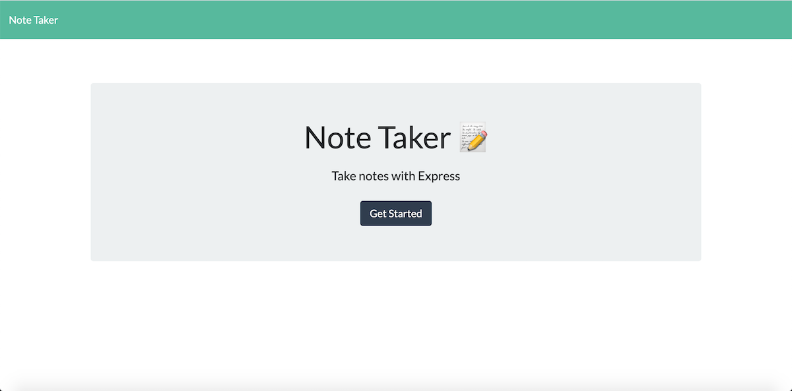
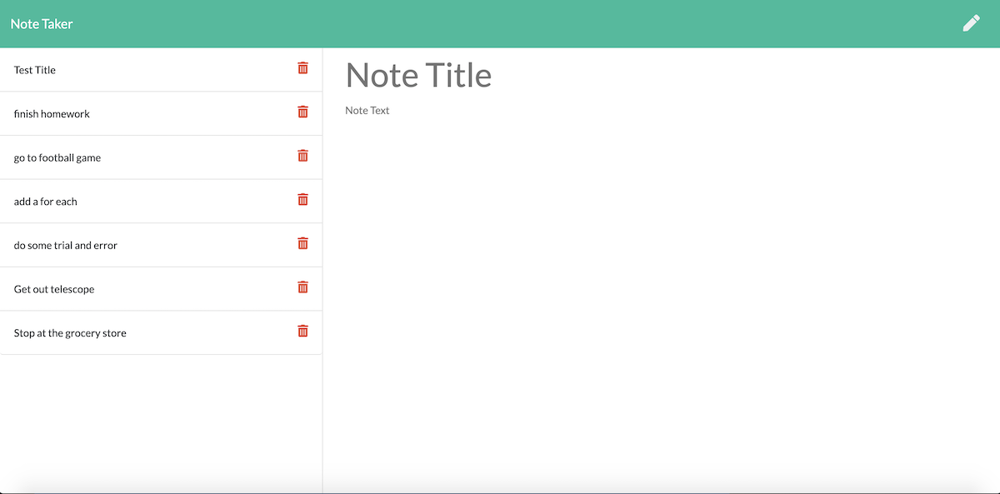
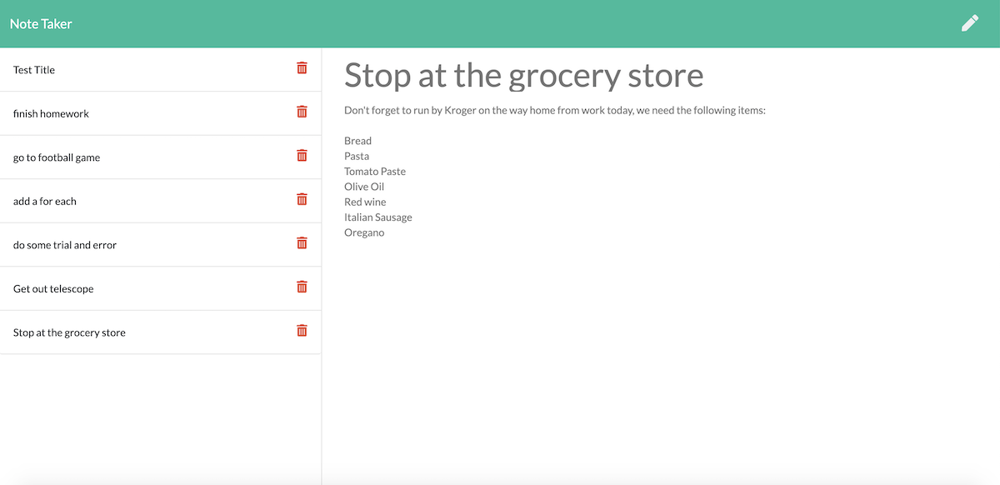

# Note-Taker

## Table of Contents
#### &nbsp;&nbsp;&nbsp;&nbsp;[1)&nbsp;Introduction](#introduction)
#### &nbsp;&nbsp;&nbsp;&nbsp;[2)&nbsp;Description](#description)
#### &nbsp;&nbsp;&nbsp;&nbsp;[3)&nbsp;Features](#features)
#### &nbsp;&nbsp;&nbsp;&nbsp;[4)&nbsp;Usage](#usage)
#### &nbsp;&nbsp;&nbsp;&nbsp;[5)&nbsp;Contributing](#contributing)
#### &nbsp;&nbsp;&nbsp;&nbsp;[6)&nbsp;License](#license)
#### &nbsp;&nbsp;&nbsp;&nbsp;[7)&nbsp;Questions](#questions)   

## Introduction 

This project completes a unit dedicated to "back-end" development.  The entire front-end user interface has been provided and our
job in completing this application is to use an Express back-end to save and retrieve note data from a JSON file.  In essence we are building the bridge that connects the two.  To do so we created GET routes for the two HTML pages.  We then created GET, POST, and DELETE API routes.  

## Description

This app will help users who have to keep track of a lot of information.  Our user story is a person who likes to keep their thoughts organized and keep track of tasks that need to be completed, because in today's busy online world it's easier than ever to forget important details.  They want to do so by writing and saving notes and then deleting the ones that are no longer applicable.  

## Features

The GET API route reads the db.json file and returns all saved notes to the client.  The POST API route receives a new note to add to the db.json file and returns the new note to the client. Unique IDs were added to each saved note with the goal of allowing a note to be deleted by a client.  To accomplish this, a DELETE API route would first read all of the notes in db.json, remove the note with a given id parameter, and rewrite the remaining notes to db.json.  This persistence in data would allow users to have the notes available as needed.

## Usage

The URL for this project is https://note-taker-hw-10-2.herokuapp.com/

The URL for this project's GitHub repository is: https://github.com/7J647/Note-Taker

## Contributing

With thanks to instructor Jonathan Watson and his team of TAs and to Josh Furlin for 
providing tutoring on this project.  And to "Stanman" for subbing and getting us all
set up on Heroku.

## License

MIT License

Copyright (c) 2020 Jeff Flynn

Permission is hereby granted, free of charge, to any person obtaining a copy
of this software and associated documentation files (the "Software"), to deal
in the Software without restriction, including without limitation the rights
to use, copy, modify, merge, publish, distribute, sublicense, and/or sell
copies of the Software, and to permit persons to whom the Software is
furnished to do so, subject to the following conditions:

The above copyright notice and this permission notice shall be included in all
copies or substantial portions of the Software.

THE SOFTWARE IS PROVIDED "AS IS", WITHOUT WARRANTY OF ANY KIND, EXPRESS OR
IMPLIED, INCLUDING BUT NOT LIMITED TO THE WARRANTIES OF MERCHANTABILITY,
FITNESS FOR A PARTICULAR PURPOSE AND NONINFRINGEMENT. IN NO EVENT SHALL THE
AUTHORS OR COPYRIGHT HOLDERS BE LIABLE FOR ANY CLAIM, DAMAGES OR OTHER
LIABILITY, WHETHER IN AN ACTION OF CONTRACT, TORT OR OTHERWISE, ARISING FROM,
OUT OF OR IN CONNECTION WITH THE SOFTWARE OR THE USE OR OTHER DEALINGS IN THE
SOFTWARE.

## Questions

Connect with me at Github: <a href="https://github.com/7J647">7J647</a> &nbsp;&nbsp;&nbsp;&nbsp;
Contact me via Email: [jeffreyedwardflynn@gmail.com](mailto:jeffreyedwardflynn@gmail.com)
 